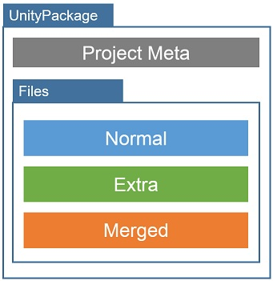
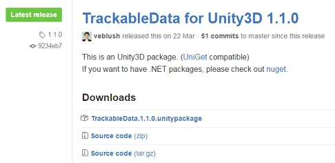
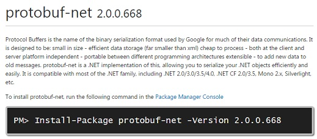

## UniGet Package

### Package

UniGet UnityPackage (a.k.a. uniget-package) looks like:



Normal UnityPackage just contains normal files. But UnityPackages has a project
meta file and files which are categorized as normal, extra and merged.

#### Project meta file

Project meta file is plain json file containing meta data of package.
Path of this file should be /Assets/UnityPackages/{package-id}.json in
UnityPackage.

- Basic: Id, version, author, owner, description of project.
- Dependencies: Package lists that this package depends on.
- Files: File lists that this package contains.
  All files are categorized as normal, extra and merged.

#### Files

Regular unity-package contains normal files and when importing it all files
are extracted and imported to your project. But uniget-package sets flags for
every file as following:

- Normal: Most essential files. e.g. Sources, DLLs for running library.
- Extra: Additional files. e.g. Sample, Documentation and so on.
- Merged: Merged library files which this uniget-package depends on.
  When an uniget-package with merged libary is imported, all required files
  are in place.

### Project file

Following json file is an example of uniget-package project, which builds
TypeAlias package with uniget.

```json
{
  "id": "TypeAlias",
  "version": "1.1.2",
  "authors": [ "Esun Kim" ],
  "owners": [ "Esun Kim" ],
  "description": "Library that makes the unique alias of types in .NET.",
  "dependencies": {
    "NetLegacySupport": {
      "version": ">=1.1.0",
      "source": "github:SaladLab/NetLegacySupport"
    }
  },
  "files": [
    "../TypeAlias.Net35/bin/Release/TypeAlias.dll",
    "$dependencies$"
  ]
}
```

### Dependency file

Following json file is an example of dependency file which can download
all dependent libraries listed on this file.

```json
{
  "dependencies": {
    "AkkaInterfacedSlimSocket": {
      "version": ">=0.2.1",
      "source": "github:SaladLab/Akka.Interfaced.SlimSocket"
    },
    "TrackableData": {
      "version": ">=1.1.0",
      "source": "github:SaladLab/TrackableData"
    },   
    "UiManager": {
      "version": ">=1.0.0",
      "source": "github:SaladLab/Unity3D.UiManager"
    }
  }
}
```

It uses same format with project file but only `dependencies` section is
necessary for working.

## Package source

Unity-packages can be bought and downloaded from
[assetstore](www.assetstore.unity3d.com)
but it doesn't seem to expose any public api to access their assets.
So it's impossible for uniget to use unity-packages on assetstore.

Alternative two package sources are provided: Github and NuGet.

### Github



You can publish a uniget-package on github release page.
If you follow the file name convension on uploading your assets, UniGet can
fetch a correct asset that version specifies.

Following json accesses [github/SaladLab/TrackableData/1.1.0](https://github.com/SaladLab/TrackableData/releases/tag/1.1.0)
package.

```json
"TrackableData": {
  "version": ">=1.1.0",
  "source": "github:SaladLab/TrackableData"
}
```

### NuGet



NuGet repository is the biggest one in .NET ecosystem
but there are problems for using NuGet as a uniget-package source.

Unity3D requires
- Meta files for all source files.
- Other files like prefab could be contained in a package.
- Dedicated target framework moniker.

But NuGet doesn't support them. So instead of using NuGet for uploading
uniget-package, just use it as a secondary repository for downloading NuGet
package which Unity3D can understand.

Following json accesses [nuget/protobuf-net/2.0.0.668](https://www.nuget.org/packages/protobuf-net/2.0.0.668)
package.

```json
"protobuf-net": {
  "version": "2.0.0.668",
  "source": "nuget:net20"
}
```
